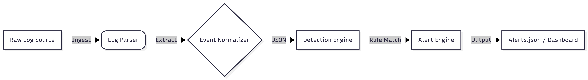
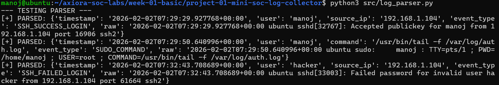
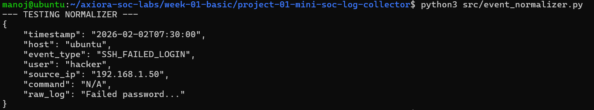
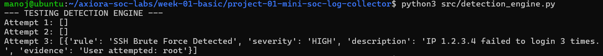
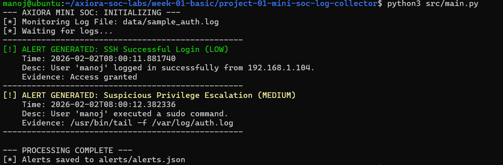
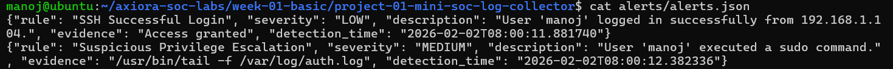

# Mini SOC Log Collector & Alert Engine

## 🚀 Week 1 - Project 1 | AXIORA SOC Labs

**Objective:** Build a lightweight Security Operations Center (SOC) log ingestion and alerting system on Raspberry Pi 5. This project mimics the core functionality of a Tier-1 SIEM (Security Information and Event Management) system: ingesting raw Linux telemetry, normalizing it, and running rule-based detection logic.

---

## 🏗 Architecture

The system follows a standard data pipeline used in enterprise SIEMs:



---

## 🛠 Tech Stack

**Platform:** Raspberry Pi 5 / Ubuntu Linux

**Language:** Python 3.x

**Log Source:** ```/var/log/auth.log```(Linux Authentication Logs)

**Output:** Structured JSON Alerts + Terminal Dashboard

---

## 🔍 Detection Logic

This engine currently implements:

#### 1. SSH Brute Force Detection
* *Logic:* Monitors `SSH_FAILED_LOGIN` events.
* *Trigger:* >3 failed attempts from the same source IP in a single batch.
* *Severity:* **HIGH**

#### 2. Privilege Escalation Monitoring
* *Logic:* Detects any usage of the `sudo` command.
* *Trigger:* Immediate on event.
* *Severity:* **MEDIUM**

#### 3. Successful Access Monitoring
* *Logic:* Tracks successful SSH entries for audit trails.
* *Severity:* **LOW**

---

## 📂 Project Structure

```text
week-01/
├── data/               # Sample log data for testing
├── src/
│   ├── log_parser.py       # Extracts User, IP, Timestamp from raw text
│   ├── event_normalizer.py # Standardizes events to AXIORA schema
│   ├── detection_engine.py # The "Brain": State & Logic rules
│   ├── alert_engine.py     # The "Voice": Saves & Prints alerts
│   └── main.py             # Pipeline Orchestrator
└── alerts/             # Generated security alerts (JSON)

```
---

## 🚀 How to Run

1. Setup Environment:
```
python3 --version
```

2. Run the SOC Engine:
```
python3 src/main.py
```

3. View Alerts:
```
cat alerts/alerts.json
```

## 📸 System Outputs

### 1. Log Parser Output
*Extracting raw logs into structured dictionaries.*


### 2. Event Normalizer
*Standardizing data for the Detection Engine.*


### 3. Detection Engine Test
*Simulating a Brute Force attack to trigger logic.*


### 4. Main Dashboard (Live Execution)
*The full pipeline running against real logs.*


### 5. JSON Alert Output
*The final evidence stored for SOC analysts.*



---

### 🚀 Week 1 - Project 2 | Security Incident Response Update

**Objective:** Upgrade the SOC from simple detection (Tier-1) to deep investigation (Tier-2). Added automated risk scoring, attack timeline reconstruction, and incident reporting.

#### 🕵️‍♂️ New Forensic Capabilities

1.  **Automated Attack Grouping:**
    * Instead of 100 separate alerts, the system groups them into **One Attack Chain** per IP.

2.  **Kill Chain Timeline:**
    * Reconstructs the attacker's steps chronologically:
    * `Failed Login (root)` -> `Failed Login (admin)` -> `Successful Login (hacker)`

3.  **Risk Scoring Engine (UEBA):**
    * Calculates a threat score (0-100) based on behavior context.
    * **+10** per attempt | **+20** for targeting root | **+40** for successful breach.

#### 📊 Sample Investigation Report
*Generated automatically by `src/investigation_reporter.py`*

```json
{
    "incident_id": "INC-192-168-1-200-1770465252",
    "risk_score": 100,
    "severity": "CRITICAL",
    "summary": "Brute Force attack followed by Successful Login",
    "recommended_actions": [
        "Block IP 192.168.1.200",
        "Reset password for user: hacker"
    ]
}
```

----

### 🚀 Week 2 - Project 1 | MITRE ATT&CK Mapping Engine

**Objective:** Upgrade the SOC from basic detection to an Enterprise-Grade Threat Intelligence platform by automatically mapping attacker behavior to the MITRE ATT&CK framework.

#### 🧠 Detection Engineering Logic
The system analyzes the attack sequence and applies multi-technique mapping:
* **T1110 (Brute Force) -> Credential Access:** Applied when multiple failed logins are detected from a single source.
* **T1078 (Valid Accounts) -> Persistence:** Applied *only* if the brute force is immediately followed by a successful login.
* **T1021 (Remote Services) -> Lateral Movement:** Applied because the breach occurred over an SSH session.

#### 📊 Sample Enriched Report (Snippet)
```json
"mitre_attack": {
    "techniques": [
        {
            "technique_id": "T1110",
            "technique_name": "Brute Force",
            "tactic": "Credential Access"
        },
        {
            "technique_id": "T1078",
            "technique_name": "Valid Accounts",
            "tactic": "Persistence / Initial Access"
        }
    ],
    "confidence": "HIGH"
}

---

### 🚀 Week 2 - Project 2 | Threat Intelligence (TI) Fusion Engine

**Objective:** Integrate external Threat Intelligence to dynamically adjust risk scores and reduce SOC analyst fatigue using automated Indicator of Compromise (IOC) enrichment.

#### 🧠 TI Risk Adjustment Logic
* **IP Reputation Lookup:** Queries an AbuseIPDB-style database for the attacker's source IP.
* **Dynamic Risk Modification:** * Abuse Score > 80: **+30 Risk Points**
  * Abuse Score > 50: **+20 Risk Points**
  * Known Good IP: **-10 Risk Points**
* **Automated Escalation:** If the fused risk score hits >= 90, the incident is automatically escalated to **CRITICAL**, and an urgent edge-firewall block action is injected.

#### 📊 Threat Intel Payload (Snippet)
```json
"threat_intelligence": {
    "ip_reputation": {
        "abuse_confidence_score": 85,
        "total_reports": 24,
        "country_code": "RU",
        "is_malicious": true
    },
    "risk_modifier": "+30"
}